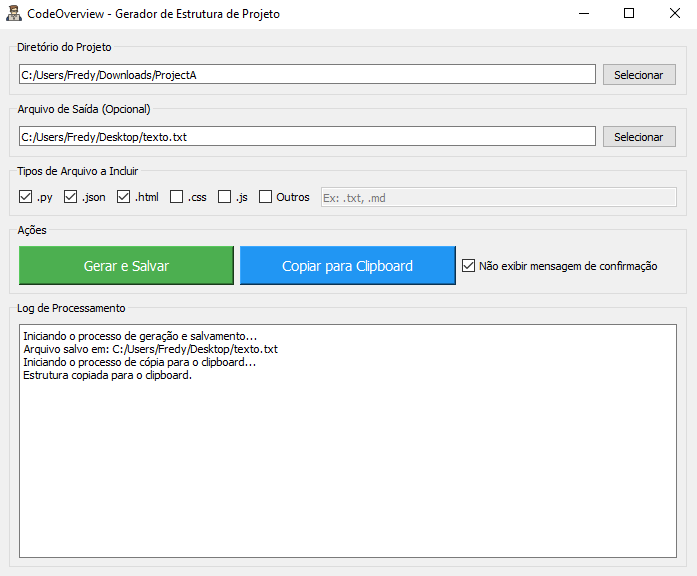

# CodeOverview

Uma aplicação desktop desenvolvida em Python utilizando PyQt5, que analisa a estrutura de um projeto, coleta conteúdos de arquivos especificados e gera um texto estruturado. A aplicação permite salvar a estrutura em um arquivo de texto ou copiar diretamente para a área de transferência.

Este projeto foi desenvolvido para facilitar a análise e documentação da estrutura e conteúdo de projetos, integrando-se facilmente com ferramentas de inteligência artificial como o GPT.

Com o CodeOverview, compartilhar a estrutura do seu projeto ficou muito mais simples – sem precisar enviar todos os arquivos manualmente! 😎👍

## 📋 Funcionalidades

- Selecionar o diretório do projeto a ser analisado.
- Escolher os tipos de arquivos a serem incluídos (por padrão: `.py`, `.json`, `.html`, `.css`, `.js`).
- Adicionar tipos de arquivos personalizados.
- Gerar e salvar a estrutura em um arquivo de texto.
- Copiar a estrutura diretamente para a área de transferência, com ou sem mensagem de confirmação.
- Log detalhado das operações realizadas e erros encontrados.

## 📸 Screenshots



## 📥 Download

Você pode baixar a versão compilada do **CodeOverview** para Windows através do link abaixo:

- [CodeOverview v1.0.0 - Executável para Windows](https://github.com/fredy-prudente/CodeOverview/releases/download/1.0.0/CodeOverview.exe)

## 🚀 Instalação

### 📋 Pré-requisitos

- Python 3.6 ou superior
- Pip (gerenciador de pacotes do Python)

### 📦 Passo a Passo

1. **Clone o Repositório:**

   ```bash
   git clone https://github.com/fredy-prudente/CodeOverview.git
   cd CodeOverview
2. **Criar um Ambiente Virtual (Opcional, mas Recomendado):**

    ```bash
    python -m venv venv
    ```
3. **Ativar o Ambiente Virtual:**

    Windows:

    ```bash
    venv\Scripts\activate
    ```
    macOS/Linux:

    ```bash
    source venv/bin/activate
    ```

4. **Instalar as Dependências:**

    ```bash
    pip install -r requirements.txt
    ```
### 🛠️ Uso

1. **Executar a Aplicação:**

    ```bash
    python -m CodeOverview.main
    ```

2. **Interface da Aplicação:**
    - **Diretório do Projeto:** Clique em "Selecionar" para escolher o diretório do projeto que deseja analisar.

    - **Arquivo de Saída (Opcional):** Se desejar salvar a estrutura gerada em um arquivo de texto, clique em "Selecionar" para definir o local e o nome do arquivo.
    - **Tipos de Arquivo:** Selecione os tipos de arquivos que deseja incluir na análise. Você pode marcar a opção "Outros" e especificar extensões adicionais.
    - **Ações:**
        - **Gerar e Salvar:** Gera a estrutura e salva no arquivo especificado.
        - **Copiar para Clipboard:** Copia a estrutura para a área de transferência. Marque a opção "Não exibir mensagem de confirmação" se desejar copiar sem receber uma notificação.
    - **Log de Processamento:** Visualize detalhes das operações realizadas e quaisquer erros encontrados.

### 🧪 Testes

Para executar os testes unitários, certifique-se de estar no diretório raiz do projeto e execute:

    python -m unittest discover tests

### 🤝 Contribuição

Contribuições são bem-vindas! Sinta-se à vontade para abrir issues ou enviar pull requests.

### 📝 Licença

Este projeto está licenciado sob a Licença MIT. Veja o arquivo LICENSE para mais detalhes.